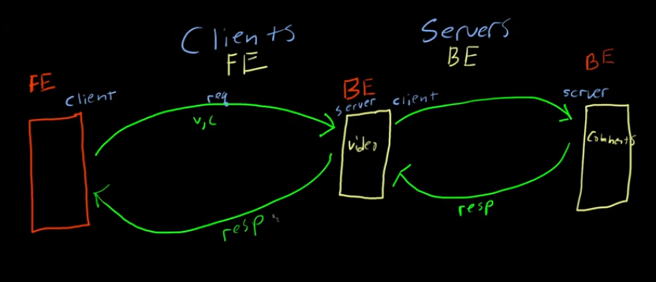

# HTTP Request and Rrsponses:

At the heart of http is simple request and response system.

> Requesting computer -> client
> Response computer -> server

 
 Two machine are connected within the network an they want to talk to each other they establish TCP connection between them.
  ##            A -------- B  
                     TCP

> But how would device B understand what device A is talking about?
    These needs to be a common language -> this is protocol

          Add 2 3\n
  A     -------------->    B      Add 2 3
        <--------------             
             s \n 

We define the specification (protocol) for a server that does Add, sub, ops.

### Http is also a protocol where

 1. Client asks for something from server
 2. Server response

> In Http the request and response are encoded as "message" 

> GET /foo Http/1.1  \r\n

### Http Body:
Body is what you pass after an "empty line"
But server can not perpetually wait for body to come
Hence, client is required to pass Content-length header.

> Also in header "Content-type" -> server knows how to process the data
   * Server can choose not to follow it

## Note: Youcan define your own protocol as long as:
1. Client knows how to format and send
2. Server knows how tp interpret.

* Redis implement their own protocal called RESP

* Http specification become a standard, hence when browser make call to url they:
1. Establish TCP with server
2. Send req as http spec message
3. receives a message and process it.

